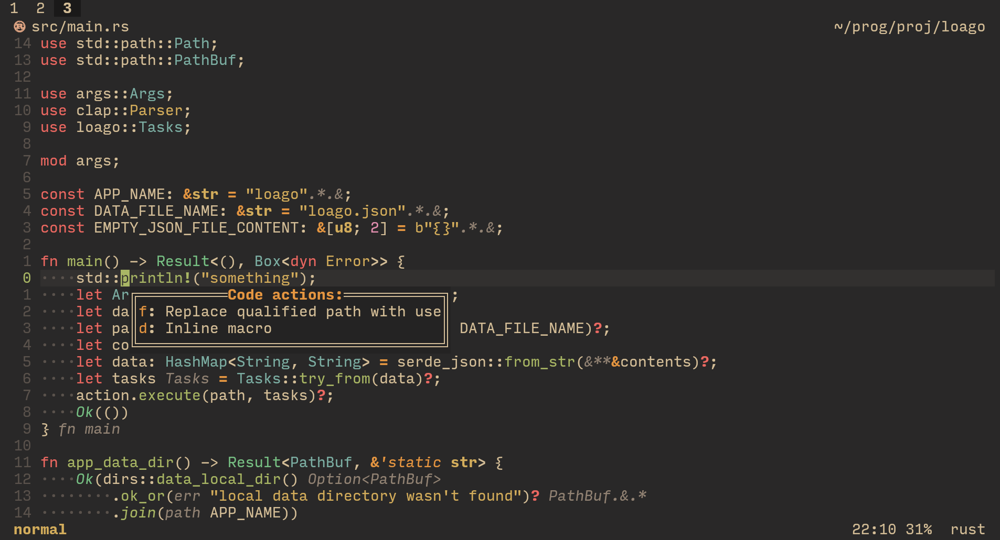
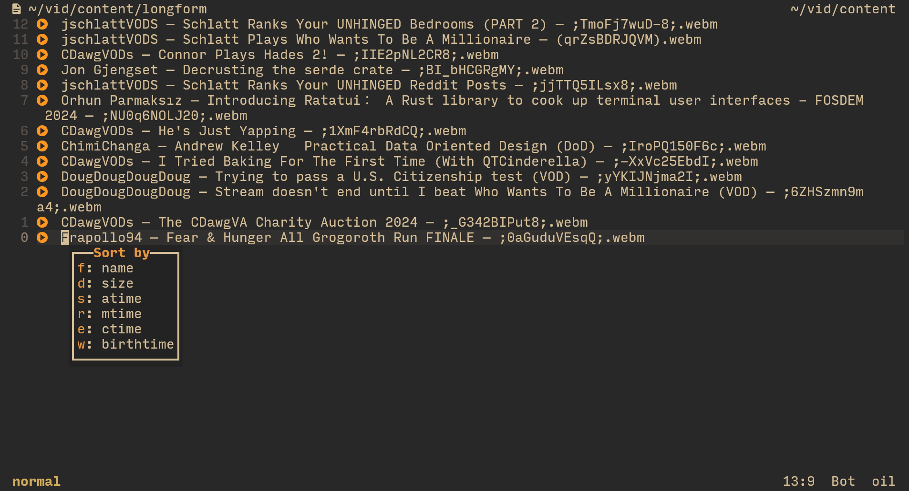
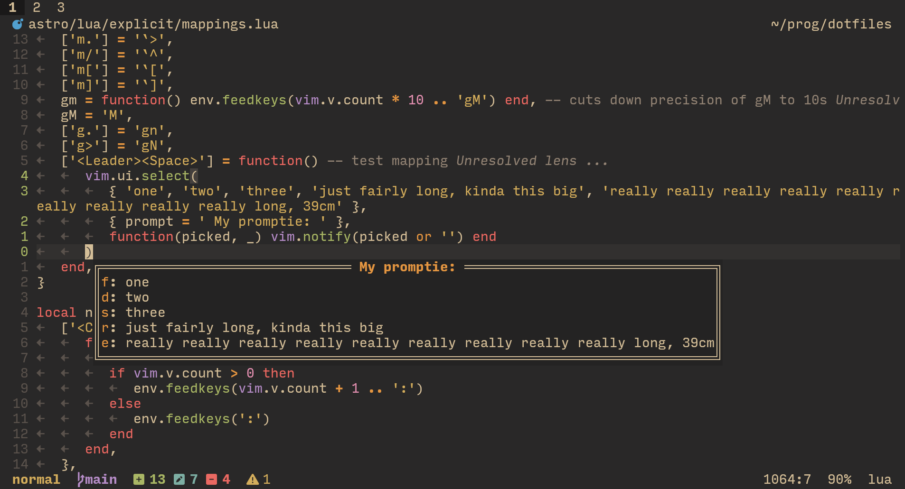
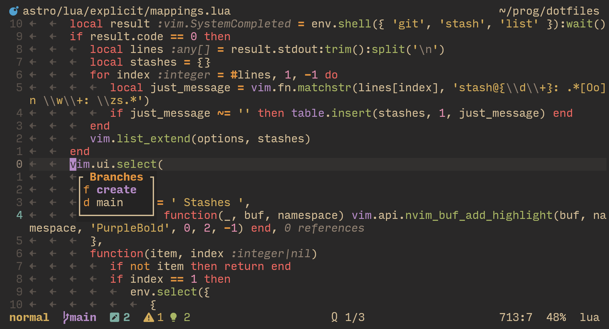
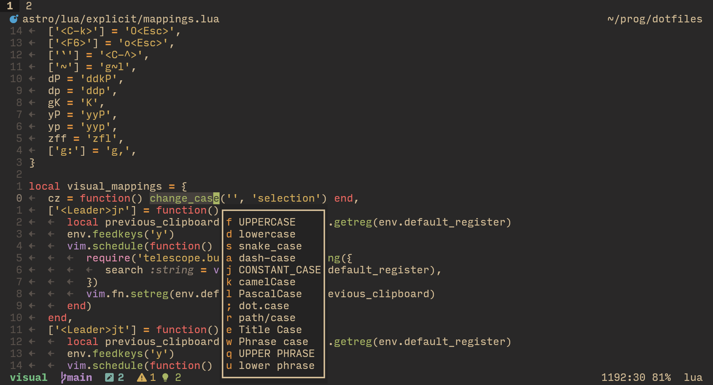

# selabel

> `vim.ui.SElect` by LABEL

`vim.ui.select` is a neat interface that is unfortunately not ergonomic to use.

It presents all of the options on their own lines, and wants you to type in a number and then press enter, by default.

That's pretty terrible!
You will barely ever even see 10 different options, so having to always press enter is pretty jarring, especially when you pick among like, 4 items (a fairly general case).

But then also, pressing numbers is kinda not ergonomic, too. We have so many other keys that are far easier to reach!

[`dressing.nvim`](https://github.com/stevearc/dressing.nvim) provides you 4 other options for `vim.ui.select`, but all of them miss the memo that you will barely ever encounter more than 10 options, and should be able to pick each with a single key.

This plugin solves both of these issues, while also providing a nice looking interface.

You get a floating window with all of the options in it.
To the left are the "labels" — you can press that key to select its option.
If you press any other key except one of the valid labels, nothing happens. You can press `<Esc>` (escape) to cancel, though.

So now your code actions (`:h vim.lsp.buf.code_action()`),



[`oil.nvim`](https://github.com/stevearc/oil.nvim) sorting,



and other places that use `vim.ui.select`



are really pretty! And faster to use :3

## More visual examples

I made git stashes / branches UIs using this plugin.

They are not included in the plugin — this is just an example of what you can do with `vim.ui.select`:



[video of me using them](https://asciinema.org/a/qBCLORIkwsU2javWW5xj71SlA)

[`text-case.nvim`](https://github.com/johmsalas/text-case.nvim) has a weird design decision: instead of just using `vim.ui.select` and then letting the user change the interface using something like `dressing.nvim`, they _explicitly_ implement telescope support.

So I implemented it myself (once again, not included in the plugin, just a showcase):



## Installation

With lazy.nvim:

```lua
return {
    'Axlefublr/selabel.nvim',
    opts = {},
},
```

`opts = {}` makes sure that the setup function is called.
If you want to change some plugin options (next section), put them here!

## Configuraton

```lua
---@class PluginOpts
---An array of characters, each of which is responsible for picking that number of an option.
---For example if you provide `{ 'a', 'b', 'c' }`, you'll need to press `a` to pick the first option, `b` to pick the second, and `c` for third.
---This plugin will error out if it doesn't have enough labels to display all options given to it, so my recommendation is 15+ characters.
---(default `{ 'f', 'd', 's', 'a', 'j', 'k', 'l', ';', 'r', 'e', 'w', 'q', 'u', 'i', 'o', 'p', 'v', 'c', 'x', 'z', 'm', ',', '.', '/' }` )
---@field labels string[]
---@field label_highlight string Highlight group to color the label letters with. (default Orange)
---@field separator string Separator between the label letter and the item text (default ': ')
---@field separator_highlight string Highlight group to color the separator with (default Bold)
---@field inject boolean Replace `vim.ui.select`. (default true)
---Use the `prompt` provided to `opts` of `vim.ui.select` as the title of the floating window. (default true)
---@field enable_prompt boolean
---This plugin relies on a hack: it needs to sleep (default 1 ms) to make sure it will create the floating window before holding up the thread by asking the user for a key.
---If after executing `vim.ui.select` you can't press any keys except the labels, and yet the floating window is not there, increase this value.
---(This is not a direct sleep: it first sleeps, and then appends the key asking onto the nvim event loop. So it's not like you need to guess the perfect amount of sleep here, which is why it can be just 1)
---@field hack integer
---Either a table to provide to the `opts` of `:h nvim_open_win()`, or a function that returns that table.
---If height is not specified, it's calculated automatically from the amount of items.
---If width is not specified, it's calculated automatically from the longest item + label width (or the width of the prompt, if it's specified and enabled and is bigger than the longest item).
---The function is automatically passed the count of items as the first argument, and the longest item's length + label length as the second.
---The `title` option is automatically set to the `prompt` provided to `vim.ui.select`, unless you set this plugin's `enable_prompt` option to false.
---default = {
---  relative = 'cursor',
---  style = 'minimal',
---  border = 'double',
---  title_pos = 'center',
---  row = 1,
---  col = 1,
---}
---@field win_opts table|function
---A function to execute after the floating window presenting the options, gets created (but before `hack`).
---The function is passed three arguments, that you may use: the window id, the buffer id, and the namespace id.
---This plugin option is for a default "after action", but you can actually pass this same option to the `opts` of `vim.ui.select`, to override this default.
---Keep in mind that the floating window and buffer do *not* become the current window + buffer, so if you want to target them, you'll have to use the arguments provided into the function.
---This was initially made to allow you to add custom syntax highlighting to the presented options.
---after = function(window, buffer, namespace)
---    vim.api.nvim_buf_add_highlight(buffer, namespace, 'PurpleBold', 0, 3, -1)
---end
---I use this in my personal config to color the first option specially, for two of my custom pickers.
---(default: nothing)
---@field after function?

---If you like one of these defaults, *don't* specify it.
---If you like all of these defaults, leave `opts = {}`.
---Don't waste the precious computer's efforts 🥺!
---@type PluginOpts
local plugin_opts = {
    labels = { 'f', 'd', 's', 'a', 'j', 'k', 'l', ';', 'r', 'e', 'w', 'q', 'u', 'i', 'o', 'p', 'v', 'c', 'x', 'z', 'm', ',', '.', '/' },
    label_highlight = 'Orange',
    separator = ': ',
    separator_highlight = 'Bold',
    inject = true,
    enable_prompt = true,
    hack = 1,
    win_opts = {
        relative = 'cursor',
        style = 'minimal',
        border = 'double',
        title_pos = 'center',
        row = 1,
        col = 1,
    },
    after = nil
}
```
